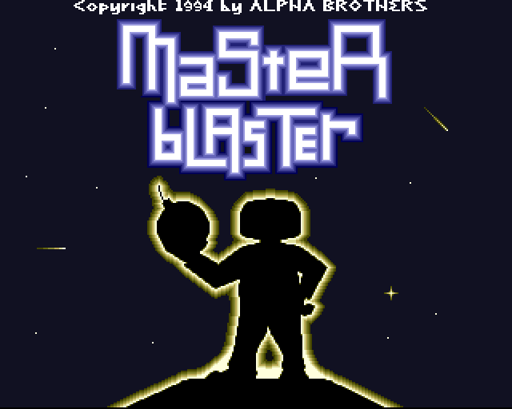

# MasterBlaster v1.0

-blue)

> Relive the excitement of the original Master Blaster, a competitive arcade game originally developed for the Amiga in 1995 by the Alpha Brothers. Challenge your friends in classic Bomberman-style gameplay featuring strategic action and explosive fun!

- **Topics**: Tilemaps, Animation, Multiplayer
- [**Download**](https://github.com/zigurous/unity-bomberman-tutorial/archive/refs/heads/main.zip)
- [**Watch Video**](https://youtu.be/8agb6x5RpOI)

---

## Controls

### Menus / Title screens

| Action | Keyboard | Gamepad |
|---|---|---|
| Navigate | Arrow keys | Left stick / D-pad |
| Confirm / Advance | Enter or Space | A (Xbox) / Cross (PS) |

### In-game (per player)

| Action | Keyboard | Gamepad |
|---|---|---|
| Move | Arrow keys or WASD | Left stick or D-pad |
| Place bomb | Space | A (Xbox) / Cross (PS) |
| Detonate remote bomb | Space (hold) | RB (Xbox) / R1 (PS) |

> **Controller assignment** is automatic — the first connected gamepad becomes Player 1, the second Player 2, etc. Players without a controller become AI opponents.

---

## Known Bugs / Issues

- **Credits → Menu skip** — Pressing any input on the Credits screen advances two steps (Credits → Title → Menu) in the same frame instead of stopping at the Title screen. Root cause: a persistent `ContinueOnAnyInput` component on the Systems prefab fires alongside the one in the Credits scene. *Workaround: avoid pressing input on the Credits screen.*

- **Alternate level spawn points not implemented** — When "Normal Level" is set to NO in the menu, alternate map layouts load but player spawn offsets are not yet adjusted (`LoadAlternateLevelSettings` in `GameManager.cs` is a stub). Players spawn at the same corner positions as the normal level.

---

## Third-Party Assets

### Unity Packages (via Package Manager)

| Package | Version |
|---|---|
| Unity Input System | 1.18.0 |
| Universal Render Pipeline (URP) | 17.3.0 |
| Netcode for GameObjects | 2.10.0 |
| Unity Services Multiplayer | 2.1.3 |
| ML-Agents | 4.0.0 |
| AI Navigation | 2.0.10 |
| 2D Animation | 13.0.4 |
| 2D Pixel Perfect | 5.1.1 |
| 2D Sprite Shape | 13.0.0 |
| 2D Tilemap | 1.0.0 |
| TextMesh Pro (ugui) | 2.0.0 |
| Test Framework | 1.4.5 |

### Embedded Asset-Store / Third-Party Assets

| Asset | Location | Notes |
|---|---|---|
| **Feel** by More Mountains | `Assets/Feel/` | Game-feel feedback library (MMFeedbacks, MMTools, NiceVibrations) |
| **TextMesh Pro** (resources) | `Assets/TextMesh Pro/` | Fonts, shaders, and examples imported into the project |
